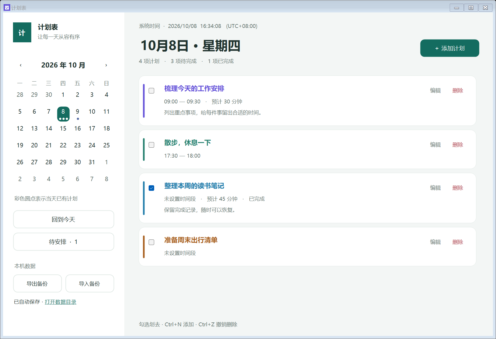
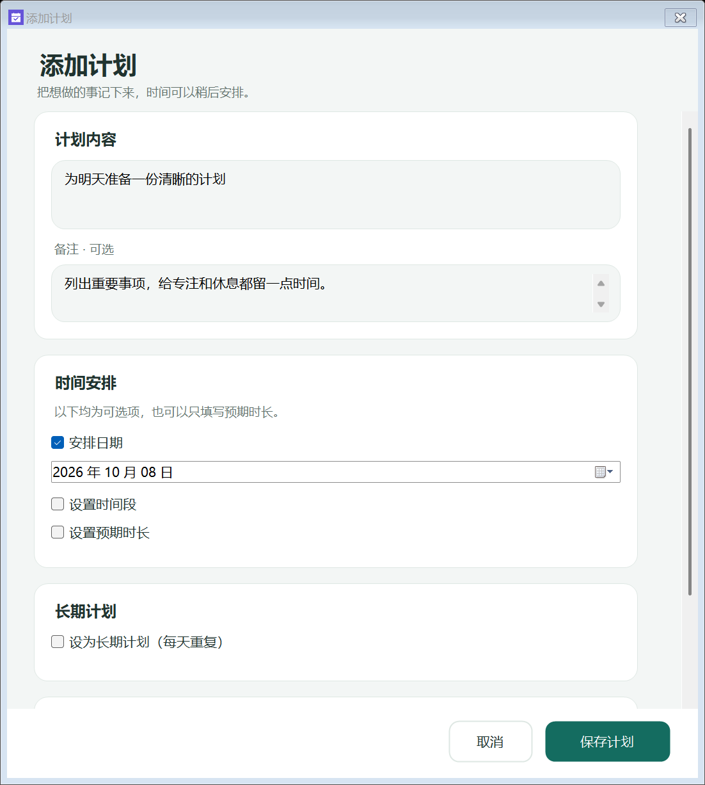
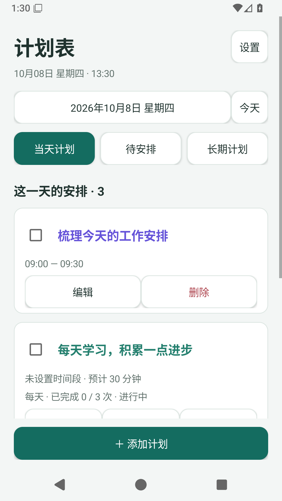
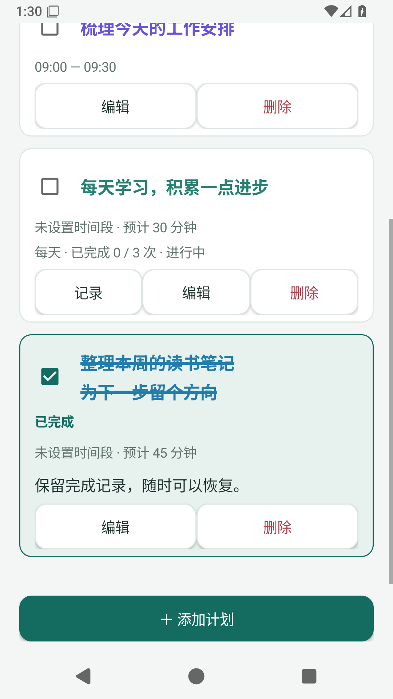
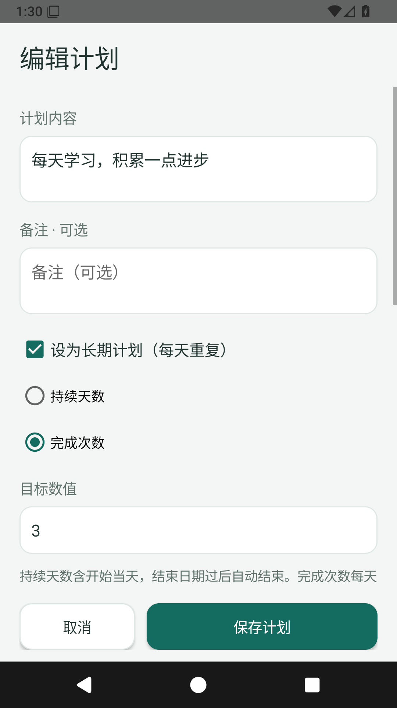
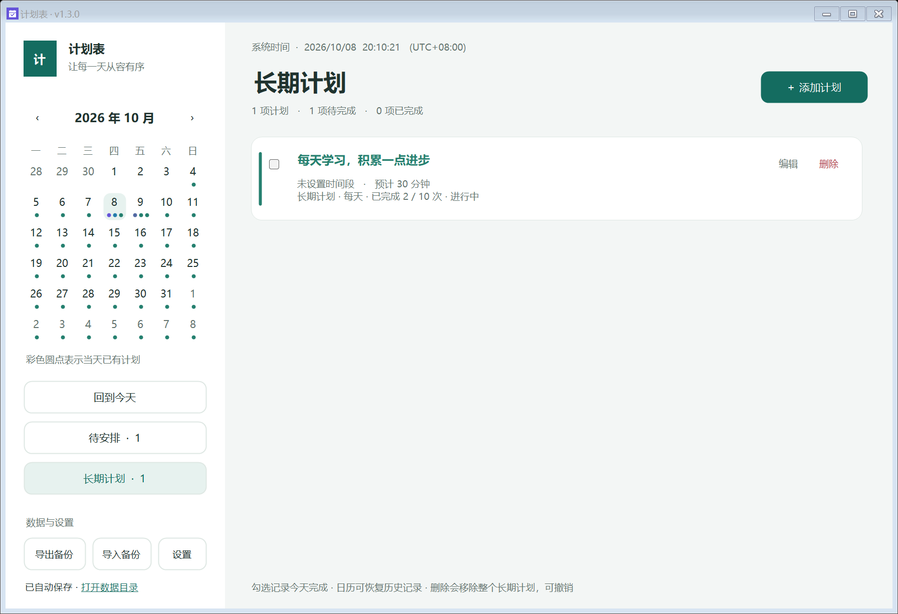
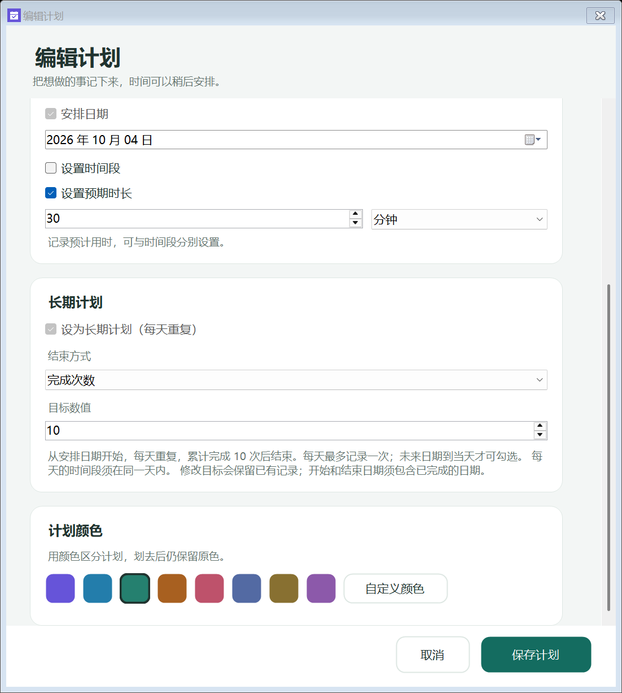
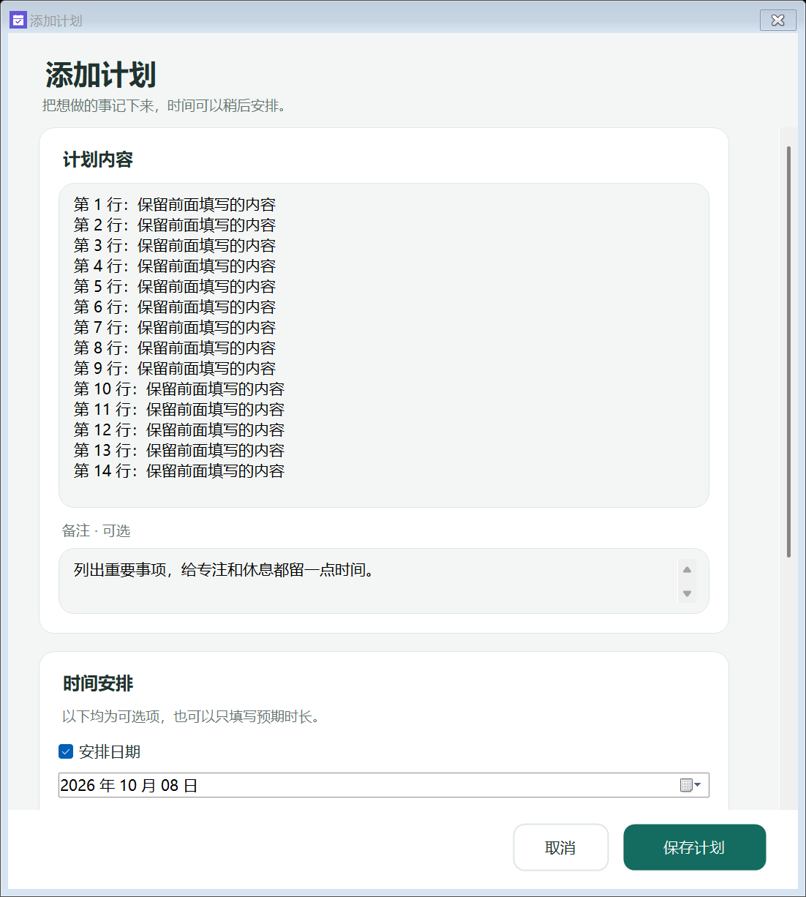
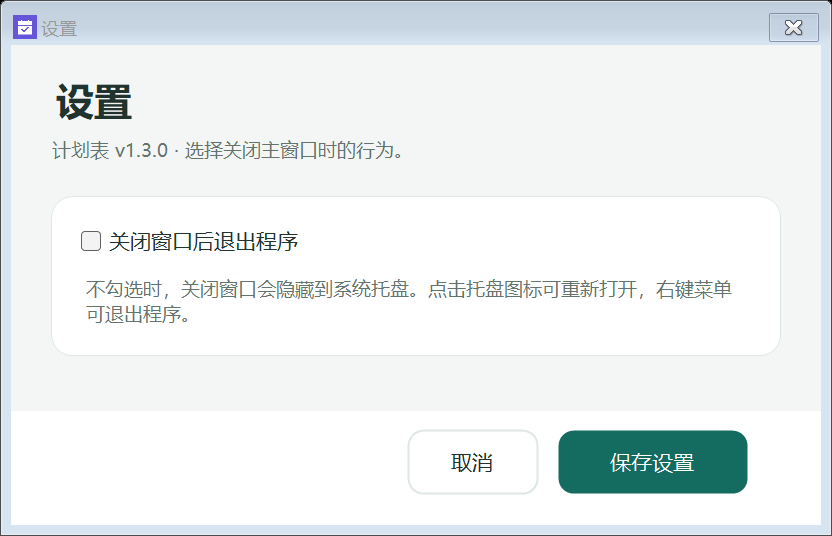

# 计划表 · Plan Reminder

一款离线使用的 Windows / Android 计划表。用日历安排计划，用颜色区分内容，完成后直接划去。





## 下载与运行

在 [Releases](https://github.com/flyfishliu031-lab/Plan-Reminder/releases) 下载：

- **Windows 安装版**：`PlanReminder-1.4.0-Setup-x64.exe`，安装到当前用户目录，可创建桌面快捷方式。
- **Windows 便携版**：`PlanReminder-1.4.0-Portable-x64.zip`，解压后双击 `PlanReminder.exe`。
- **Android 手机版**：`PlanReminder-1.4.0-Android.apk`，支持 Android 8.0 及以上；下载到手机后打开 APK 安装。

支持 Windows 10/11 64 位。成品包含 .NET 运行环境，无需另装 .NET，无需账号或联网。

1.1.0 重新设计了主窗口与编辑窗口：浅色背景、青色主按钮、圆角计划卡片、按需展开的时间设置。表单标签随内容调整高度，小窗口可滚动，底部保存按钮始终可用。升级沿用原有计划数据。

1.2.0 增加系统托盘与设置。升级前请先退出正在运行的版本，再安装或启动新版。

1.3.0 增加每天重复的长期计划，并让“计划内容”输入框随换行、自动折行增高。主窗口标题和设置窗口会显示版本号，便于确认启动的是新版。

1.4.0 加粗完成内容的删除线，并增加完成卡片背景、边框与状态标记，同时提供独立安卓手机版。

**便携版升级**：先从托盘菜单退出原来的计划表，将新版解压到原来的程序目录并替换程序文件，再运行该目录内的 `PlanReminder.exe`。另一个位置安装的新版不会自动替换旧便携版；继续点击旧文件仍会启动旧版。请确认窗口标题含 `v1.4.0`。

旧计划与备份可直接读取。新增的长期计划使用数据格式版本 2；保存后请继续使用 1.3.0 或更新版本，旧版无法读取新的格式。个人数据始终保存在本机原数据目录。

## 安卓使用

- 主界面选择日期打开系统月历；“今天”回到系统当前日期，“待安排”显示没有日期的计划，“长期计划”查看全部重复计划及进度。
- 添加 / 编辑时可设置每天重复、持续天数或完成次数、时间段和预期分钟数。内容随换行增高，较长表单滚动，保存按钮固定在底部。
- 勾选后显示粗删除线和完成标记，取消勾选恢复。长期计划按日期勾选，未来日期不能预先完成；“记录”查看完成日期，点选日期后可恢复该日。
- 删除前确认，10 秒内可撤销；本机文件自动保存，上次保存的文件用于损坏恢复。
- 右上角“设置”提供 JSON 备份导出、导入和版本信息。备份与 Windows 1.3.0 及以上兼容，可手动迁移；两台设备不会自动同步。
- 安卓系统可能要求允许当前浏览器或文件管理器安装此 APK，可按系统提示为该来源允许安装。本项目提供直接安装的 APK，未上架应用商店。
- 升级安装相同签名的新版会保留本机计划；**卸载安卓应用会删除其本机数据，请先导出备份**。应用不请求网络、通知或广泛文件访问权限，导入导出通过系统文件选择器完成。

以下为 Android 模拟器中的示例计划，截图只包含演示数据：







### 安卓源码构建

使用 JDK 17、Gradle 8.13、Android SDK API 36 / Build Tools 35.0.0，原生 Java 和 Android 控件，无额外运行时依赖。

```powershell
./scripts/build-android.ps1 -AndroidSdk 'C:\Android\Sdk' -JavaHome 'C:\Java\jdk17' -Gradle 'gradle' -Release
```

Windows 脚本在独立临时目录构建，避免中文路径及 OneDrive 缓存锁。首次发布生成 `.signing` 中的密钥和密码配置；后续更新复用该密钥。**私下备份整个 `.signing` 目录，不上传 GitHub；丢失密钥将无法覆盖安装更新。** 未加 `-Release` 时仅构建、检查调试包，不生成公开安装包。

其他系统可运行 `gradle -p android assembleDebug lintDebug`，发布签名由 `PLAN_KEYSTORE` 和 `PLAN_STORE_PASSWORD` 环境变量提供。设备测试为 `gradle -p android connectedDebugAndroidTest`；持续检查在 Android API 26 / 36 模拟器上验证数据、表单、旋转草稿及实际截图。

## 长期计划

- 添加或编辑时勾选“设为长期计划（每天重复）”，上方安排日期作为开始日期。
- 选择“持续天数”：支持 1–3650 天，含开始和结束当天；结束日期过后自动结束，漏做不会延长计划。
- 选择“完成次数”：支持 1–10000 次，每个日期最多记录一次，达到目标后结束。
- 日历中每天的完成情况独立保存，勾选只划去当天。取消勾选恢复该日期；次数目标未满足时会重新继续。
- 左侧“长期计划”显示全部长期计划、进度和结束状态；勾选记录今天完成。未来日期到当天才可勾选，也可在日历中补记过去日期。
- 编辑目标保留完成记录，日期范围须包含已有记录。有记录的长期计划不能直接改为单次计划。
- 删除移除整项长期计划及记录，10 秒内可撤销。导出、导入备份包含长期计划和全部完成日期。
- 可选择每天的时间段或预期时长；每天时间段须在同一天内，跨天安排使用单次计划。





## 多行计划内容

“计划内容”输入框随换行和自动折行增高，删除文字后可缩回。内容较长时整个表单滚动，当前输入行保持可见；底部保存按钮始终可用。



## 托盘与关闭行为

运行时，右下角系统托盘会显示“计划表”图标。Windows 可能将它收纳在隐藏图标区域，可点击任务栏的“^”查看。

- 点击或双击托盘图标，重新打开计划表；右键菜单包含“打开计划表”“设置”“退出程序”。
- 主窗口左下角也有“设置”入口。
- 默认不勾选“关闭窗口后退出程序”：点击主窗口关闭按钮或按 `Alt+F4` 会隐藏到托盘，程序继续运行。
- 勾选该选项并保存后，关闭主窗口会完全退出。托盘菜单“退出程序”始终会完全退出。
- 再次启动同一数据目录的计划表时会恢复已有窗口，不会再开一个后台实例。
- 设置保存在数据目录的 `settings.json`，保存后立即生效，重启后仍然保留。导出计划备份只包含计划内容。



## 功能

- 月历与当天计划列表，支持“回到今天”和“待安排”。
- 添加、编辑计划标题与备注；日期、时间段、预期时长均可选。
- 跨天计划在覆盖的每一天显示，恰好结束于午夜时不占用下一天。
- 每个新计划自动分配颜色，支持预设色与自定义颜色。
- 勾选表示完成：文字保留原色并显示删除线。取消勾选即可恢复。
- 删除立即保存，10 秒内可以撤销；快捷键 `Ctrl+Z` 同样可以撤销。
- 按开始时间排序，无时间段的计划排在后面；划去不改变排序。
- 时间段重叠时提示，仍允许保存。
- 系统时间、时区与“今天”标记随设备更新；浏览其他日期时不会被自动跳回今天。
- 自动保存、导入与导出 JSON 备份、上一次写入的自动备份及损坏数据恢复。
- `Ctrl+N` 添加计划，月历支持方向键移动日期。

预期时长单独记录，不是倒计时。长期计划按天重复；到点提醒、多设备同步和每周指定日期重复暂未提供。

## 数据位置与备份

数据保存在 `%LOCALAPPDATA%\PlanReminder\plans.json`，左下角可以打开数据目录。安装版和便携版使用同一份数据。关闭软件、升级或卸载不会主动删除计划。

每次保存通过临时文件替换完成；上一次有效数据保留在 `plans.json.bak`。无法读取主文件时，软件会询问是否恢复自动备份，并另存损坏的原文件。

“导出备份”生成 JSON 文件。“导入备份”按计划编号合并，编号相同时保留更新时间较新的版本，避免重复导入。删除后超过 10 秒需从先前导出的备份恢复。

时间段保存为本地日历日期和钟表时间。例如 09:00 的计划在修改设备时区后仍显示 09:00。软件显示的是设备当前时间，不通过互联网校准时钟。

标题最多 500 字，备注最多 5000 字；预期时长支持 1 分钟到 365 天。备份与数据文件上限 20 MB。长内容在列表中截断，可在编辑窗口查看全文。

源码仓库和 Releases 只包含程序与示例界面，个人计划数据不上传 GitHub。

## 从源码构建

需要 Windows、.NET 10 SDK；生成安装包另需 Inno Setup 6.7 或更高版本。

```powershell
./scripts/build.ps1 -InnoCompiler 'C:\Program Files (x86)\Inno Setup 6\ISCC.exe'
```

脚本构建应用、运行功能检查、发布包含运行环境的便携版，再生成安装包和 SHA-256 校验文件。输出位于 `artifacts`，不提交二进制到源码历史。

仅构建与检查：

```powershell
$env:MSBuildEnableWorkloadResolver = 'false'
dotnet build -c Release
dotnet ./bin/Release/net10.0-windows/PlanReminder.dll --self-test
```

81 项检查覆盖可选时间、跨天边界、颜色分配、划去与恢复、删除撤销、数据重启保留、备份合并、损坏恢复、托盘关闭 / 恢复 / 退出、设置持久化、长期计划日期与次数目标、每天完成记录、历史恢复、重复时间重叠与排序、旧版数据兼容。检查只操作临时目录。

界面检查会打开样例窗口并生成预览，验证文字布局、窗口缩小、多行输入增高与缩回、自动折行、当前输入行可见、长期计划、可选字段展开及保存错误提示：

```powershell
dotnet ./bin/Release/net10.0-windows/PlanReminder.dll --ui-check ./artifacts/ui-preview
dotnet ./bin/Release/net10.0-windows/PlanReminder.dll --ui-check ./artifacts/ui-96 --ui-check-96
```

第二条使用独立进程的 96 DPI 测试模式，不改变 Windows 显示设置。已在 96 DPI 基准窗口及本机 144 DPI（150% 缩放）下验证；多显示器之间移动窗口仍需在对应设备上检验。

用于界面演示的样例数据可在独立目录创建：

```powershell
./bin/Release/net10.0-windows/PlanReminder.exe --demo --data-dir ./artifacts/demo
```

## 项目结构

使用 .NET 原生 WinForms、System.Text.Json 和文件系统；没有额外运行时依赖。`PlanItem.cs` 定义计划与时间规则，`PlanStore.cs` 负责保存，`MainForm.cs`、`PlanEditor.cs` 与日历/卡片控件负责界面，`SelfTest.cs` 与 `UiCheck.cs` 提供功能和布局检查。
